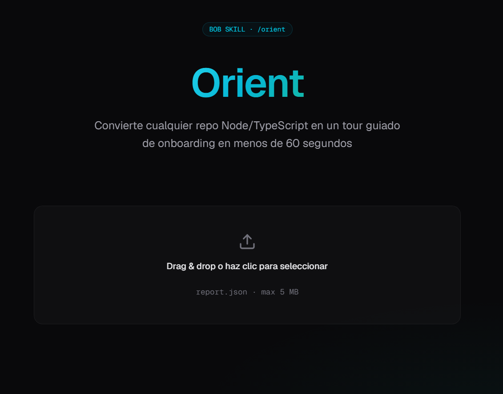
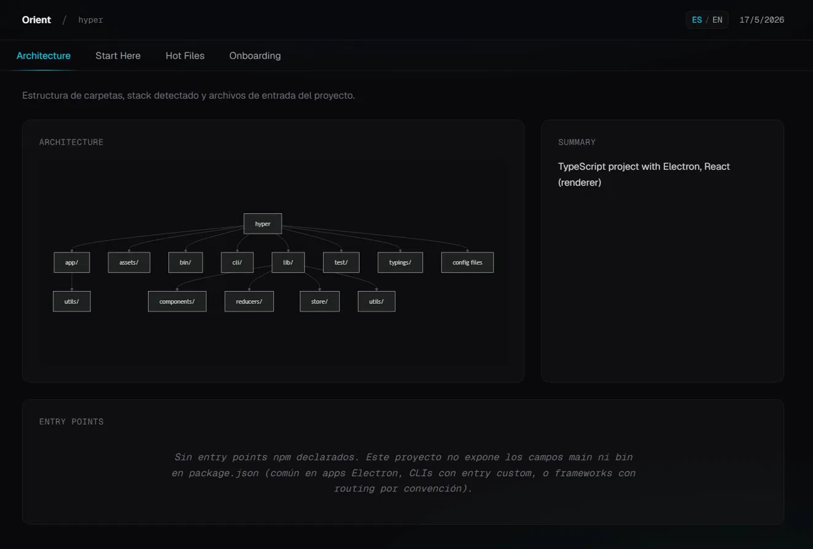
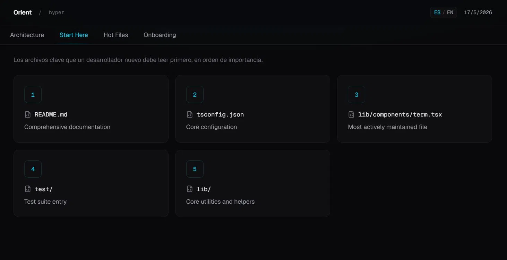
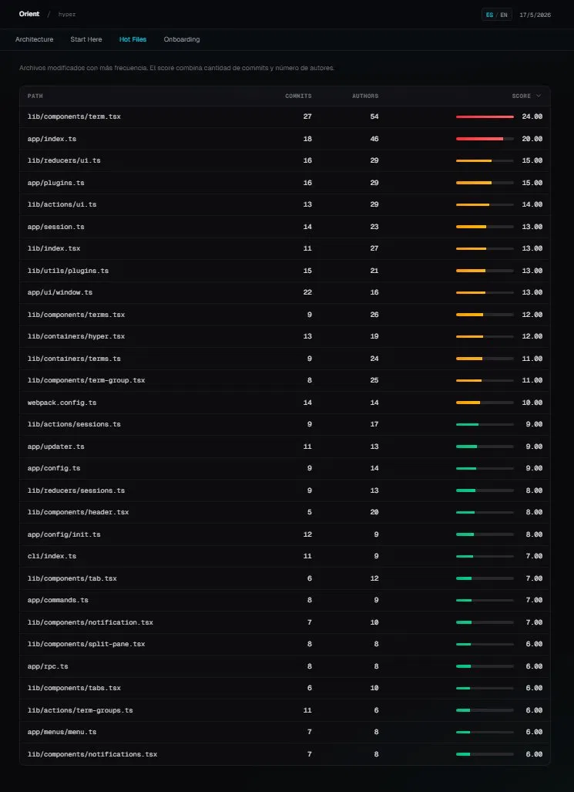
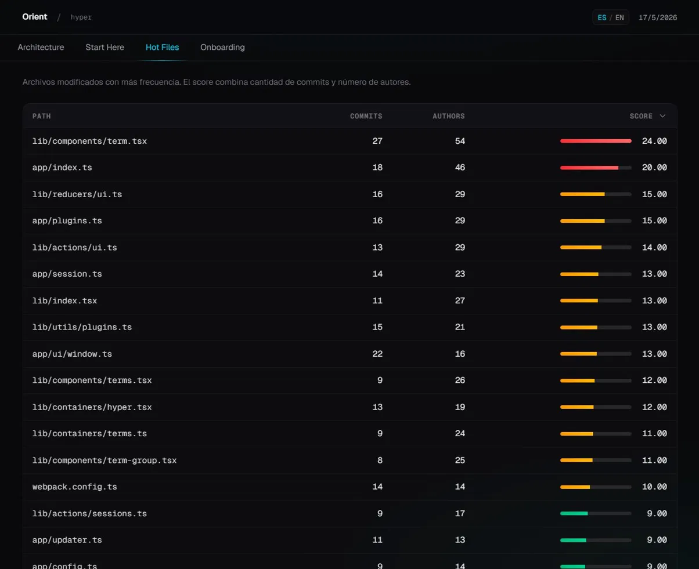
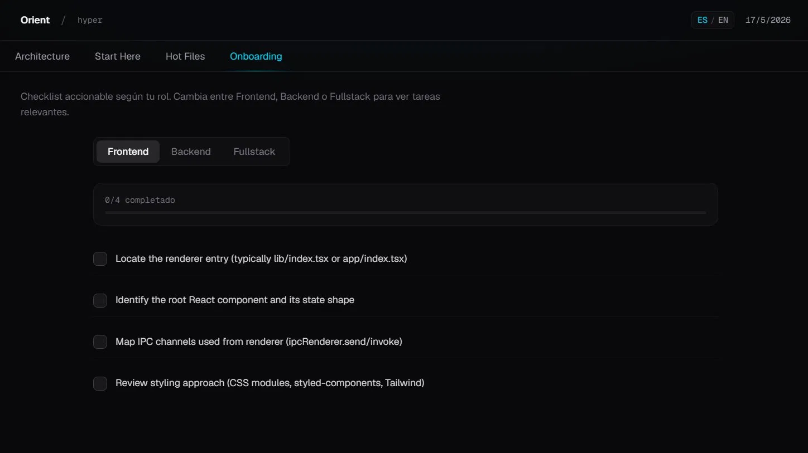
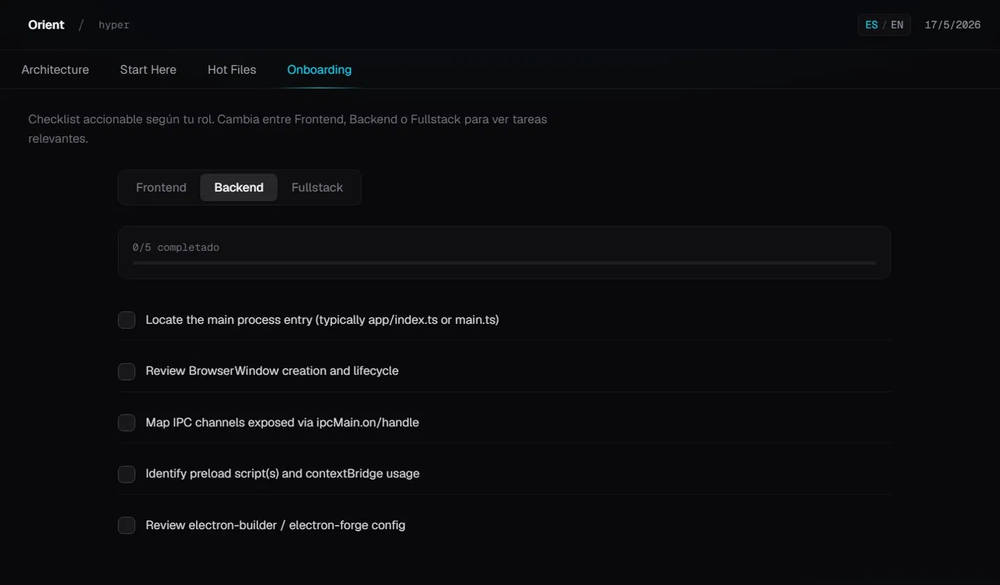
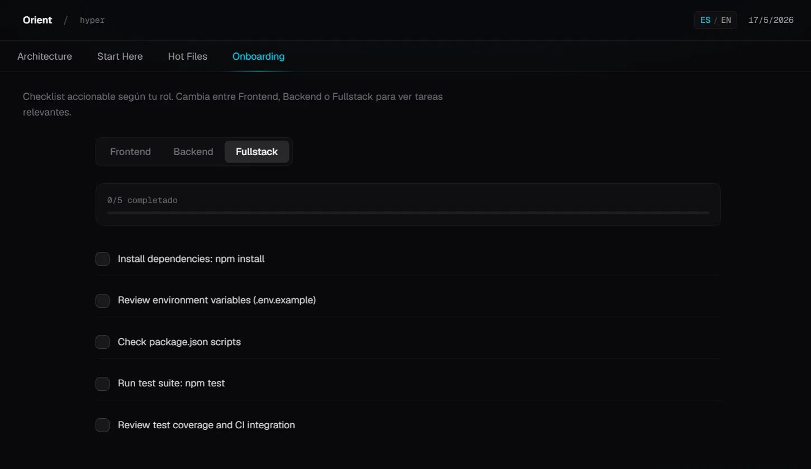

# Orient

<p align="center">
  
</p>

<p align="center">
  <strong>Transforma cualquier repo Node/TypeScript en un tour guiado de onboarding en menos de 60 segundos.</strong>
</p>

<p align="center">
  <a href="#-qué-es-orient">Qué es</a> ·
  <a href="#-características">Características</a> ·
  <a href="#-demo">Demo</a> ·
  <a href="#-quick-start">Quick Start</a> ·
  <a href="#-cómo-funciona">Cómo funciona</a> ·
  <a href="#-known-limitations">Limitations</a> ·
  <a href="#-english-summary">🇬🇧 English</a>
</p>

<p align="center">
  
  
  
  
  
  <a href="https://orient-bob-skill.vercel.app"></a>
  </p>
</p>

---

## 📖 Qué es Orient

**Onboarding técnico en repos desconocidos es lento y desestructurado.** Cuando un desarrollador se incorpora a un proyecto nuevo, tiende a perder horas (o días) navegando carpetas, leyendo READMEs incompletos y haciendo preguntas básicas al equipo. El conocimiento sobre qué archivos importan, qué stack se usa y por dónde empezar suele estar repartido entre tickets antiguos, conversaciones de Slack y la cabeza de quien lleva más tiempo.

**Orient resuelve esto en dos piezas que trabajan juntas:**

1. **Un script de análisis** (`skill/orient.js`) que se ejecuta contra cualquier repo Node/TypeScript y produce un `report.json` estructurado con stack detectado, archivos críticos, hot files (basado en git history) y un checklist de onboarding contextual al stack.

2. **Un dashboard interactivo** (`dashboard/`) construido con Next.js que renderiza ese JSON en cuatro vistas con propósito específico: Architecture, Start Here, Hot Files, Onboarding.

El flujo completo toma menos de un minuto: ejecutar el script sobre un repo desconocido, abrir el dashboard, arrastrar el JSON generado, y empezar a navegar el proyecto con contexto real.

---

## ✨ Características

- **Análisis automático de stack**: detecta runtime, package manager, frameworks (Next.js, React, Electron, NestJS, Hono, SvelteKit, Solid y más), testing libraries y CI/CD setup.
- **Hot Files con scoring real**: combina cantidad de commits y número de autores únicos en una fórmula `log(commits + 1) × √authors`. Los archivos que más colaboración han recibido pesan más.
- **Onboarding contextual por rol**: tres sub-tabs (Frontend, Backend, Fullstack) con items específicos al stack detectado. Por ejemplo, un repo Electron muestra items para BrowserWindow, IPC channels y preload scripts; un repo Next.js muestra items para App Router y server vs client components.
- **Architecture diagram dinámico**: genera un diagrama Mermaid de la estructura real del repo (no plantilla hardcoded), con sub-directorios relevantes expandidos.
- **i18n EN/ES con persistencia**: toggle entre español e inglés en el header. La preferencia se guarda en `localStorage`.
- **Arquitectura simple**: cero backend, cero autenticación, cero base de datos. El dashboard es client-side puro y los reports se persisten en `localStorage`.
- **Cross-platform**: el script funciona en Windows, macOS y Linux sin dependencias de shell pipes externos.

---

## 🎬 Demo

### Galería completa

| Vista | Screenshot |
|---|---|
| **Landing** |  |
| **Architecture** |  |
| **Start Here** |  |
| **Hot Files (full)** |  |
| **Hot Files (detalle)** |  |
| **Onboarding · Frontend** |  |
| **Onboarding · Backend** |  |
| **Onboarding · Fullstack** |  |

Los screenshots se generaron ejecutando `orient.js` contra [vercel/hyper](https://github.com/vercel/hyper) (terminal Electron con React renderer), un repo OSS real con ~140K líneas de código.

> 🌐 **Live demo**: [orient-bob-skill.vercel.app](https://orient-bob-skill.vercel.app)

---

## 🚀 Quick Start

### Prerequisitos

- **Node.js** 18 o superior (recomendado: 22.x).
- **Git** disponible en PATH (para análisis de commits e history).
- **PowerShell** (en Windows) o **bash** (en macOS / Linux).

### 1. Clonar el repositorio

```bash
git clone https://github.com/luccii591/orient-bob-skill.git
cd orient-bob-skill
```

### 2. Analizar un repo

Ejecutar el script apuntando a la ruta absoluta del repo a analizar:

```bash
node skill/orient.js /ruta/absoluta/a/tu/repo
```

En Windows:

```powershell
node skill\orient.js C:\Users\tu-usuario\proyectos\tu-repo
```

El script:
1. Lee `package.json` del repo target.
2. Analiza commit history (últimos 2000 commits) para hot files.
3. Detecta stack, frameworks, testing libs, CI/CD.
4. Genera un `.orient/report.json` dentro del repo analizado.
5. Genera también `.orient/architecture.mmd` (diagrama Mermaid) y enriquece `AGENTS.md` si existe.

### 3. Levantar el dashboard

```bash
cd dashboard
npm install
npm run build
npm run start
```

El dashboard queda disponible en [http://localhost:3000](http://localhost:3000).

> **Nota**: en máquinas con RAM limitada (< 16 GB) usar `npm run start` después de un build previo, no `npm run dev`. Turbopack en dev mode consume mucha memoria.

### 4. Cargar el reporte

1. Abrir `http://localhost:3000` en el navegador.
2. Arrastrar el archivo `.orient/report.json` generado por el script al drop zone.
3. Navegar entre las 4 vistas.

### 5. Probar sin clonar un repo externo

El repo incluye fixtures listos para probar el dashboard sin ejecutar el script:

- `examples/sample-output.json` — fixture sintético (proyecto Next.js + Prisma ficticio).
- `examples/real-output-hyper.json` — output real de ejecutar `orient.js` sobre `vercel/hyper`.

Arrastrar cualquiera de los dos al dashboard.

---

## 🛠 Stack

| Capa | Tecnologías |
|---|---|
| **Script** | Node.js 18+, Git CLI |
| **Frontend framework** | Next.js 16.2.4 (App Router) |
| **UI library** | React 19 |
| **Type system** | TypeScript (strict mode) |
| **Styling** | Tailwind CSS v4 |
| **Iconography** | lucide-react |
| **Diagrams** | Mermaid.js |
| **Validation** | Zod |
| **Build** | Turbopack |
| **Deploy** | Vercel (free tier) |

---

## 📂 Estructura del proyecto

```
orient-bob-skill/
├── README.md                           ← Este archivo
├── AGENTS.md                           ← Contrato del proyecto
├── docs/
│   └── plan.md                         ← Plan ejecutivo original
├── skill/
│   ├── orient.md                       ← Bob Skill spec (428 líneas)
│   └── orient.js                       ← Node fallback ejecutable
├── examples/
│   ├── sample-output.json              ← Fixture sintético
│   └── real-output-hyper.json          ← Output real de vercel/hyper
├── dashboard/
│   ├── app/
│   │   ├── layout.tsx                  ← Root layout + LanguageProvider
│   │   ├── page.tsx                    ← Landing con drag & drop
│   │   ├── globals.css                 ← Tailwind v4 + design tokens
│   │   └── report/[id]/
│   │       └── page.tsx                ← Vista del reporte (4 tabs)
│   ├── components/
│   │   ├── file-upload.tsx
│   │   ├── architecture-view.tsx
│   │   ├── start-here-view.tsx
│   │   ├── hot-files-view.tsx
│   │   └── onboarding-view.tsx
│   ├── lib/
│   │   ├── report-schema.ts            ← Zod schema
│   │   ├── report-store.ts             ← localStorage helpers
│   │   └── i18n.tsx                    ← Context i18n (ES/EN)
│   ├── public/
│   │   └── screenshots/                ← Capturas para el README
│   ├── package.json
│   └── tsconfig.json
└── bob_sessions/                       ← Documentación de proceso
    ├── 01-plan-architecture.{md,png}
    ├── 02-skill-and-scaffold.{md,png}
    ├── ...
    └── 10-grep-and-entrypoints.{md,png}
```

---

## 🧠 Cómo funciona

### El Script (`skill/orient.js`)

**Detección de stack**: lee `package.json` y combina `dependencies` + `devDependencies`. Aplica un diccionario de patterns sobre los nombres de paquetes para etiquetar frameworks, testing libraries y otras herramientas. Cubre stacks modernos (Next.js, Remix, Astro, SvelteKit, Solid) y desktop hosts (Electron, Tauri), con etiquetado contextual de React según ambiente (React SPA vs React renderer en Electron/Tauri).

**Hot Files scoring**: ejecuta `git log --pretty=format: --name-only -n 2000` y agrupa modificaciones por archivo. Para cada archivo, calcula autores únicos con `git log --follow --pretty=format:%ae` (parsing nativo en Node, sin shell pipes externos como `grep` o `sort -u` — funciona cross-platform). El score final es `log(commits + 1) × √authors`. La fórmula prioriza archivos con colaboración amplia, no solo cantidad bruta de cambios.

**Architecture diagram**: lee dinámicamente el filesystem del repo, filtra directorios irrelevantes (`node_modules`, `.git`, `dist`, etc.), y genera un grafo Mermaid con hasta 10 directorios top-level y sub-directorios relevantes (`components/`, `lib/`, `api/`, etc.). No depende de una plantilla hardcoded.

**Onboarding checklist**: en función del stack detectado, agrega items específicos a las sub-tabs frontend/backend/fullstack. Por ejemplo, detectar `electron` activa items sobre BrowserWindow, IPC channels y preload scripts; detectar `next` activa items sobre App Router y server vs client components.

### El Dashboard (`dashboard/`)

**Arquitectura client-side**: no hay backend ni base de datos. El usuario arrastra un `report.json`, se valida contra un schema Zod (`lib/report-schema.ts`), se guarda en `localStorage` con un ID UUID (`lib/report-store.ts`), y se redirige a `/report/[id]`. Múltiples reports pueden coexistir; el último se sirve por defecto.

**i18n con React Context** (`lib/i18n.tsx`): un `LanguageProvider` envuelve la app a nivel layout. El hook `useT()` devuelve un diccionario tipado con todas las claves estáticas de UI. El toggle en el header alterna entre ES y EN; el valor persiste en `localStorage` bajo la key `orient-lang`. El contenido del report (paths, descripciones de archivos, items de onboarding) **no** se traduce — viene literalmente del JSON.

**Estilo Linear/Vercel**: design tokens definidos en `globals.css` con `@theme` de Tailwind v4. Paleta cyan/teal (`#06b6d4`, `#22d3ee`, `#14b8a6`) sobre fondos zinc oscuros en capas. Tipografía Geist (sans + mono) cargada via `next/font`. Animaciones de entrada moderadas con stagger delays, respetando `prefers-reduced-motion`.

**Vista Hot Files**: tabla sortable con score bars normalizadas dinámicamente respecto al score máximo del dataset (la barra del archivo más caliente siempre está al 100%, las demás escalan proporcionalmente). El color de cada barra (rojo / amber / emerald) depende del ratio del score sobre el máximo. Los números de score se animan con un counter de 0 al valor real en ~800ms.

---

## ⚠️ Known Limitations

Esta es una v1 enfocada en demostrar el flujo de análisis end-to-end. Las siguientes son limitaciones de scope conocidas, no bugs:

- **Solo `package.json` top-level**: monorepos con workspaces (Yarn / pnpm / npm) requieren ejecutar `orient.js` en cada workspace. Una v2 podría detectar configuraciones de workspace y agregarlas.
- **Detección de frameworks por strings en `package.json`**: el script identifica frameworks por el nombre del paquete en dependencies. Frameworks cargados dinámicamente, usados via plugins, o instalados como sub-dependencies de meta-frameworks pueden no ser detectados.
- **Persistencia solo client-side**: los reports viven en `localStorage`. No hay sincronización entre máquinas ni colaboración en tiempo real. Para uso en equipo, una v2 con backend (Supabase, Neon, etc.) sería el camino.
- **Entry points limitados a convenciones npm**: solo se inspeccionan los campos `main` y `bin` de `package.json`. Aplicaciones con entry points definidos por el framework (Next.js routes, Electron `app/index.ts`, CLIs con bin custom no declarado) muestran un mensaje contextual en lugar de archivos concretos.
- **`git log --follow` y archivos renombrados/eliminados**: algunos archivos producen errores `fatal: ambiguous argument` cuando han sido renombrados o borrados en commits intermedios. Estos errores se capturan y el archivo default-ea a 1 autor.
- **Onboarding checklist con items asumidos**: los items de cada sub-tab se generan en función de heurísticas sobre frameworks detectados, no por análisis del código real. Por ejemplo, un repo React puede mostrar el item "Check state management (Redux/Zustand)" aunque use Context API. Es una guía aproximada, no una auditoría.

---

## 🗺 Roadmap

Algunas direcciones razonables para una v2 si el proyecto continuara:

- **Monorepo aware**: detectar `pnpm-workspace.yaml`, `turbo.json`, `nx.json` y agregar análisis cross-workspace.
- **Persistencia compartida**: backend opcional para guardar reports por equipo (Supabase + Auth.js).
- **Análisis de imports reales**: en vez de heurísticas por dependency name, parsear AST para descubrir qué se usa realmente y dónde.
- **Soporte para más lenguajes**: el script asume Node/TypeScript. Una v2 podría extenderse a Python, Go, Rust con detectores específicos.
- **Integración CI**: GitHub Action que regenere el report en cada push y lo publique como artifact o PR comment.
- **Diff entre reports**: comparar dos reports (un mes vs hoy) para ver cómo evolucionó el codebase.

---

## 🏗 Origin & Development

Este proyecto se construyó como **solo project** durante el **IBM Bob Dev Day Hackathon (mayo 2026)**, usando IBM Bob (asistente de IA con skills custom) como copiloto principal en la parte de implementación, y Claude como copiloto en la parte de arquitectura y revisión.

**Workflow**: cada tarea grande se planificó como un "prompt" preciso enviado a Bob (Code mode, auto-approve activado para Read/Write/Execute, confirmación manual para Network calls). Bob ejecutó cambios sobre el filesystem; cada sesión se exportó como evidencia (`bob_sessions/NN-task.md` + `.png`).

**Iteraciones documentadas** (`bob_sessions/`):

1. **Plan + Architecture** — definición del scope, contratos, plan ejecutable.
2. **Skill + Scaffold** — Bob Skill `/orient` (markdown), fallback Node, scaffold Next.js inicial.
3. **Dashboard components** — librería + 5 vistas + páginas, build verde.
4. **Polish UI** — estética Linear/Vercel, design tokens, animaciones, dark theme.
5. **Fixes post-polish** — score scale normalization, eliminar hint duplicado.
6. **i18n + tab descriptions** — Context API para idioma, descripción contextual por tab.
7. **Orient sobre repo real** — ejecutar `orient.js` contra `vercel/hyper`, validación.
8. **Orient fixes ronda 1** — hot files vacíos, Electron no detectado, Playwright no detectado.
9. **Orient fixes ronda 2** — Mermaid dinámico, onboarding checklist contextual a Electron.
10. **Polish final** — author counting cross-platform, mensaje en entry points vacíos.

**Reflexión sobre pair-programming con IA**: el proyecto demostró que la productividad ganada con un asistente fuerte depende menos de la velocidad de generación de código y más de la **calidad de los prompts**. Prompts vagos producen código vago; prompts con restricciones explícitas, ejemplos de output esperado y validación al final producen código que apenas requiere iteración. El proyecto consumió aproximadamente **5 Bobcoins de un budget de 40** distribuidos en 10 sesiones, validando que con buena planificación una idea no trivial puede ejecutarse con holgura presupuestaria.

Originalmente el proyecto se concibió para submission a hackathon (deadline 3 de mayo 2026). Se decidió continuar el desarrollo en modo portfolio después del deadline, priorizando calidad técnica y documentación sobre velocidad de submission.

---

## 📄 License

MIT License — ver [LICENSE](LICENSE) para detalles.

---

## 🤝 Acknowledgments

- **IBM Bob Dev Day** team por la plataforma del hackathon.
- **Anthropic** por Claude, copiloto de arquitectura y revisión.
- **Vercel** por Next.js, Turbopack, y el free tier de hosting.
- **vercel/hyper** team por mantener un repo OSS real que sirvió como banco de pruebas.

---

## 🇬🇧 English Summary

**Orient** transforms any Node/TypeScript repository into a guided onboarding tour in under 60 seconds. It consists of two pieces working together:

1. A **CLI script** (`skill/orient.js`) that analyzes a target repo: detects stack and frameworks (Next.js, React, Electron, NestJS, and 15+ more), parses Git history to surface hot files (scored by `log(commits + 1) × √unique_authors`), generates a Mermaid architecture diagram from the actual filesystem, and produces a contextual onboarding checklist split by role (frontend / backend / fullstack).

2. An **interactive dashboard** (`dashboard/`) built with Next.js 16, React 19, TypeScript strict, Tailwind v4, and Mermaid.js. It renders the JSON output across four views with clear purpose: Architecture, Start Here, Hot Files, Onboarding. Fully client-side: no backend, no database, reports persist in `localStorage`. Bilingual UI (Spanish / English) with `localStorage`-persisted preference.

### Quick Start (English)

```bash
git clone https://github.com/luccii591/orient-bob-skill.git
cd orient-bob-skill

# Analyze any Node/TypeScript repo
node skill/orient.js /path/to/your/repo

# Launch the dashboard
cd dashboard
npm install
npm run build
npm run start
```

Open [http://localhost:3000](http://localhost:3000), drag the generated `.orient/report.json` into the drop zone, and explore.

### Project Highlights

- **Cross-platform script**: native Node parsing of `git log`, no Unix shell dependencies (`grep`, `sort`, `wc`). Works on Windows, macOS, Linux.
- **Production-grade design**: Linear/Vercel-inspired dark theme with cyan/teal accents, Geist typography, moderate motion respecting `prefers-reduced-motion`.
- **Honest about scope**: see [Known Limitations](#-known-limitations) for a candid list of what v1 does and doesn't cover.
- **Real-world tested**: shipped output is validated against [vercel/hyper](https://github.com/vercel/hyper), a real Electron-based OSS project with ~140K LOC.

### License

MIT.

### Development context

Built solo during IBM Bob Dev Day Hackathon (May 2026). Originally intended as a hackathon submission, evolved into a portfolio project after the deadline. Ten development sessions documented in `bob_sessions/` for transparency. See [Origin & Development](#-origin--development) for the full story.